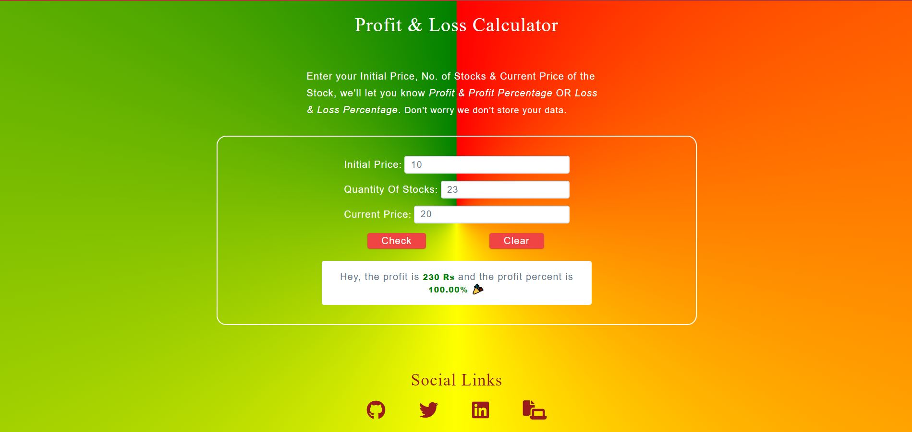

# Mark-14 Profit And Loss Calculator

[Live Link](https://neog-profit-and-loss-calculator.vercel.app/)

A website which helps user how much profit or loss he/she is making in percentage & absolute value.

## Tech Used

- HTML
- CSS
- JS

## Description:

- Given Initial Price, No. of Stocks & Current Price of the Stock, we'll let you know Profit & Profit Percentage OR Loss & Loss Percentage.
- Error msgs to user if

  - Any input is empty, -ve or zero.

- Clicking Clear button empties all input fields,empties the output.
- (Additional feature) If you click input with output showing for previous inputs, we assume you are changing the inputs, so we clear down the output.
- Output highlighted with red or green depending loss or profit.

## Snapshot of the app

